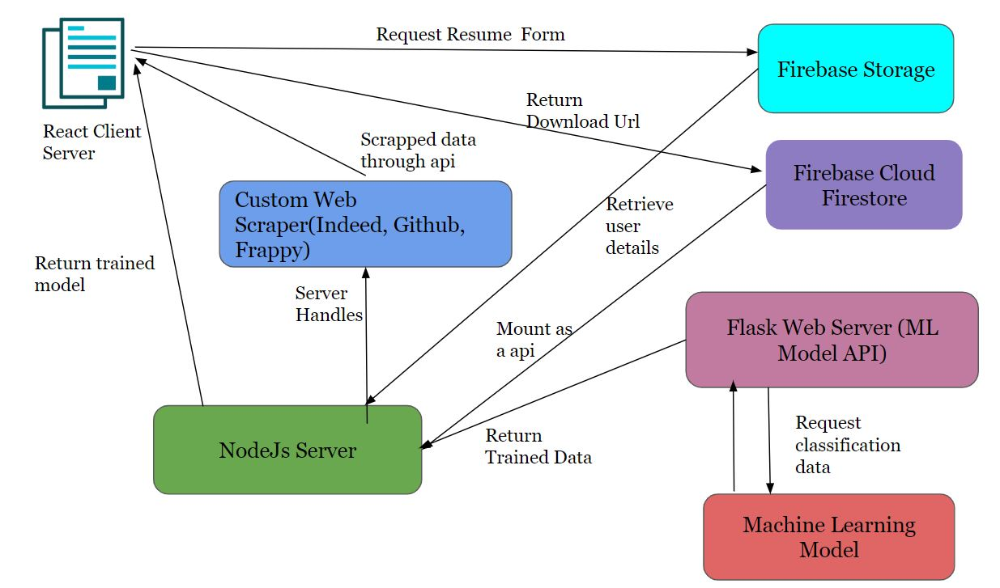
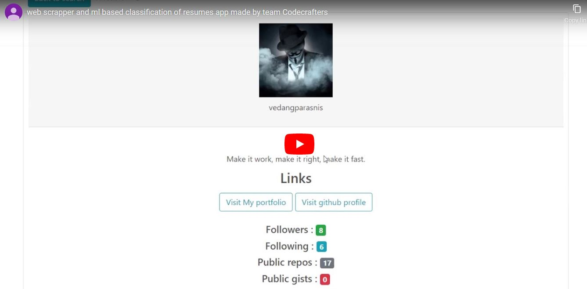

 
    
    <h3>Hackit 2.0</h3>

## Team name : *CodeCrafters* :sunglasses:

  - [Problem-Statement](#Problem-Statement)
  - [Need of the Project](#Need-of-the-Project)
  - [How ML Helps Us?](#How-ML-Helps-Us-?)
  - [Tasks](#Tasks)
  - [System Architecture](#System-Architecture)
  - [Tech stack](#Tech-stack)
  - [Folder Structure](#Folder-Structure)
  - [You tube video](#You-tube-video)
  - [Contributors](#Contributors)

## Problem Statement

Recruitment Assisting platform which will help recruiters filter out resumes for a particular job profile.
By Team CodeCrafters

## Need of the Project

Motto- By evaluating all candidates against the same screening standards, … the process will be more objective, fair and accurate.

* Evaluator should set list of standards and criteria to compare resumes
* Job Description/ any other relevant information should also be compared with resume
* Standards should not be bend, as they were created to meet the job expectations
* There are hundreds of millions of candidate profiles and CVs online
* Manual screening of resumes is still the most time-consuming part of recruiting 
* 75% to 88% of the resumes received for a role are unqualified
* Screening resumes and shortlisting candidates to interview is estimated to take 23 hours of a recruiter’s time for a single hire.

## How ML Helps Us?

Machines are better at certain things such as:
1. Sourcing 
2. Screening
3. Matching
4. Assessing
5. Helps to eliminate human bias, like candidate’s age, race, and gender by assessing candidates purely on their merits.
6. Low-value, time consuming recruiting tasks will become streamlined and automated.
7. Recruiter’s role will become more strategic.

## Tasks

* Apply ML to segregate the resumes into different classes or groups. These classes or groups must be utilised to enhance the Resume based Search Engine. 
* Create a recommender system which will prompt the recruiter with skills related to the filters provided to enhance the search. 
* Create an automated Scraper to fetch profiles from public recruitment based platforms.
* Association based mining to be used. The recruiter just needs to provide the post or position in the organisation and the tool should provide the recommended candidates

## System Architecture

 
    

## Tech stack

:one: **Client Side** :  ReactJs, Firebase, React Hooks.

:two: **Server Side** :  Flask, Node JS, cheerio(web Scraper), request .

:three: **ML Model** : Scikit-learn, nltk, ml5.js(npm module) .

:four: **Database and Storage** : Firebase Cloud Firestore .

**Clone git repository**

> Git clone "[https://github.com/Hackit-2-0/Team-CodeCrafters](https://github.com/Hackit-2-0/Team-CodeCrafters)"

## Folder Structure

:file_folder: Team-CodeCrafters :

&nbsp;&nbsp;&nbsp;&nbsp;&nbsp;&nbsp;&nbsp;:file_folder: assets.

&nbsp;&nbsp;&nbsp;&nbsp;&nbsp;&nbsp;&nbsp;:file_folder: Classificatioons.

&nbsp;&nbsp;&nbsp;&nbsp;&nbsp;&nbsp;&nbsp;:file_folder: clientform.

&nbsp;&nbsp;&nbsp;&nbsp;&nbsp;&nbsp;&nbsp;:file_folder: server.

&nbsp;&nbsp;&nbsp;&nbsp;&nbsp;&nbsp;&nbsp;:file_folder: github-finder. 

**Render React UI**

> $ cd clientform

**install node modules**

> $ npm i 

**npm start**

Runs the app in the development mode. 
Open [http://localhost:3000](http://localhost:3000) to view it in the browser.

> $ npm start 

**Start Server**

> $ cd server

> $ node app.js

## You tube video

 
<<<<<<< HEAD
    
=======
    
>>>>>>> 0b8de536f198b9a9f2c8ea70392a88d1c8191ae5

## Contributors

| Name    | Email :e-mail:  |
|---------| ------------------  |
| Vedang parasnis  | vedang.parasnis@somaiya.edu|
| Priya mane  | priya.hm@somaiya.edu|
| Pratik merchant  | pratik.merchant@somaiya.edu|
| Hritik Jaiswal  | hritik.jaiswal@somaiya.edu|

<h3 align="center"><b>Developed with :heart: by <a href="https://github.com/vedangparasnis">Vedang Parasnis </a> , <a href="https://github.com/pugnator-12"> Priya mane</a> , <a href="https://github.com/pratik6725">Pratik merchant</a> and <a href="https://github.com/hritik5102">Hritik jaiswal</a>.</b></h1>

